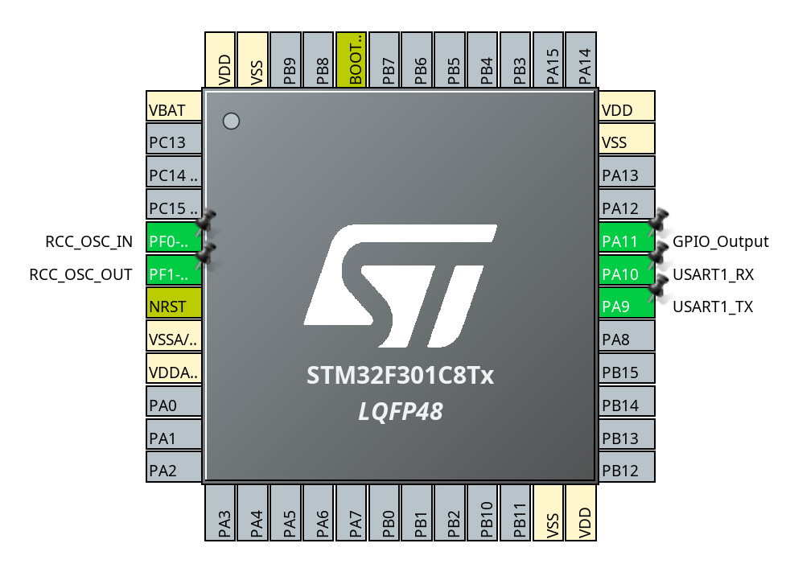

In this post I am going to use a bare bones [STM32F301C8T6TR](https://www.st.com/en/microcontrollers-microprocessors/stm32f301c8.html) MCU with a minimal schematic. The purpose of this is to show what set of minimum components you need to program a STM32 chips.


## Why?

I wanted to create my own board with a STM32 microcontroller for my own projects. I do not want to use one of the pre-made boards such as one of the [STM32 Nucleo](https://www.st.com/en/evaluation-tools/stm32-nucleo-boards.html) boards. You could create a "hat", an extension board, that fits on top of one of the existing boards, but they are big and take up a lot of space when stacked. I wanted to simply buy only the STM32 MCU and make a tiny dedicated board for the project I want to make.

So, this post documents what you need to do that.

## Hardware

The hardware used is the following:

* [STM32F301C8T6TR](https://www.st.com/en/microcontrollers-microprocessors/stm32f301c8.html) microcontroller.
* Breakout board for the LQFP48 package. I have created my own one here: [kicad-stm32-breakoutboards](https://github.com/matusnovak/kicad-stm32-breakoutboards).
* [STLINK-V3 Minie](https://www.st.com/en/development-tools/stlink-v3minie.html) for programming and debugging over USB-C.
* 1x 8 MHZ Crystal with 2x 10pF ceramic capacitors. This is optional if you want to have an external clock.
* 2x 100nF ceramic capacitors.
* 2x 10K Ohm resistors.
* 1x 1K Ohm resistor.
* 1x Any kind of low power LED.
* 2x 47uF electrolytic capacitors. Does not have to be the precise value. Anything above 10uF is good enough for this example.
* 1x LD33CV for 5V to 3.3V voltage conversion. Any 3.3V voltage regulator will be sufficient.

## Schematic

The minimal schematic that you need to program the STM32 and blink an LED is the following:


Which will look like this once assembled on a breadboard:



The STLINK-V3 will not power your STM32. The `T_VCC` is used to detect the voltage level. You will need +5V from some other source (a second USB cable?).


## Software

I have used Manjaro Linux throughout this example. However this should work with Windows as well.

### System packages

Make sure you have the following packages installed. These packages are for Arch Linux (AUR), but an equivalent exists for Ubuntu or Windows. They are needed to compile and debug a STM32 project.

```
sudo pacman -S openocd \
    arm-none-eabi-gcc \
    arm-none-eabi-newlib \
    arm-none-eabi-gdb
```

Next, you will need the [STM32CubeMX](https://www.st.com/en/development-tools/stm32cubemx.html) software for creating the initial project for the given microcontroller family.

It's available for Windows, MacOS, and Linux. This is not the same thing as the full IDE that they offer. This is only for setting up the project files.

You will have to log in, download it, and **complete the installation with the provided installer.** I recommend installing it in a home directory (the default option).

Next, the [JetBrains CLion](https://www.jetbrains.com/clion/) to write the code in.

And finally, STLink software for debugging.

### STLink

One problem that I have faced was the STLink package in AUR being outdated. It did not have the most recently updated udev rules for my STLINK-V3 MINIE. I had to build it from the source and fortunatelly that was very easy to do.

First, try installing it via a package manager. The [STLink GitHubRepo](https://github.com/stlink-org/stlink) has installation steps. In my case I have installed it via AUR:

```
sudo pacman -S stlink
```

Connect your STLink via USB and run the following command below. You don't need to connect it to the microcontroller. At least not yet.

```
st-info --probe
```

You should see an output similar to this:

```
Failed to enter SWD mode
Found 1 stlink programmers
  version:    V3J12
  serial:     0055003E3431511631343632
  flash:      0 (pagesize: 0)
  sram:       0
  chipid:     0x000
  dev-type:   unknown
```

Reports an unknown device because I have not yet connected it to the microcontroller.

**If you get "skipping device" or a similar error, remove the package, and install it from the source.** On Linux that can be done with the following steps:

```bash
# Clone it
git clone https://github.com/stlink-org/stlink.git
cd stlink

# Configure CMake project
cmake -B ./build -DCMAKE_BUILD_TYPE=Release -S .

# Build it
cmake --build ./build --target all

# Install it into the system
sudo cmake --build ./build --target install

# Done!
```

After the CMake install step my STLink started to be recognized.

## CLion Settings

Before creating a project make sure that you configure the OpenOCD and STM32CubeMX binary paths in the CLion settings. This should point to their respective binaries as shown below in the screenshot.


## STM32CubeMX

Start the STM32CubeMX and create a new project (from the top main menu -> File -> New Project). 

My STM32CubeMX binary was located here: `/home/mnovak/STM32CubeMX/STM32CubeMX`.

You will have to first find your STM32 MCU. Use the commercial part number to do that.


In the `Pinout & Configuration` tab you first must configure the pins. This will depend based on the STM32 type you have. Refer to the datasheet to find the correct pins. In my case, the `STM32F301C8T6TR` has the first UART1 on PA9 and PA10. The Crystal is connected on pins PF0 and PF1. I have used PA11 for the LED blink.



Next, in the `Connectivity` in the left hand side menu, choose the `USART1`, enable it as `Asynchronous`, and leave everything else to the default.


Next on the `Clock Configuration` tab, because we have an external Crystal, you should:
* Set PPL Source Mux to `HSE`
* Set PPLMul to `x9`
* Set System Clock Mux to `PLLCLK`
* Set APB1 Prescaler to `/2`

The MCU clock should now be at 72MHz instead of 8MHz.


Next, on the `Project Manager` tab, change the Toolchain to STM32CubeMX. The CLion will be able to open it.


And finally, click the `Generate Code` in the top right corner. Once that is done you can open it with CLion by choosing the `*.ioc` file.


## Modifying the code

When you open the project you should see that STM32CubeMX has generated some files. Every time you click the `Generate Code` the code will be generated for you.

You should write code into the `USE CODE BEGIN` and `USER CODE END` blocks, such as the one below:

```cpp
// File: Core/Src/main.c
/* USER CODE BEGIN WHILE */
while (1)
{
    /* USER CODE END WHILE */
```

In here simply add a LED toggle and print out a simple message to the UART:

```cpp
// File: Core/Src/main.c
/* USER CODE BEGIN WHILE */
while (1)
{
    HAL_GPIO_TogglePin(GPIOA, GPIO_PIN_11);
    HAL_Delay(500);

    static const char* buffer = "Hello World!\n\r";
    HAL_UART_Transmit(&huart1, (uint8_t*)buffer, strlen(buffer), 1000);
    /* USER CODE END WHILE */
```

## Connect it

Once you connect the STLink and **power on** the microcontroller the `st-link --probe` should return a positive result such as the following:

```
st-info --probe                                                                                ✔ 
Found 1 stlink programmers
  version:    V3J12
  serial:     0055003E3431511631343632
  flash:      65536 (pagesize: 2048)
  sram:       40960
  chipid:     0x439
  dev-type:   STM32F301_F302_F318
```

## Build and upload

Build the code and upload it. It is simply done by clicking on the `Play` button in the CLion IDE top menu bar. Or press the `[Shift] + [F10]` keys. No need to do any additional steps.

The output of the build should look like this:

```
Info : clock speed 1000 kHz
Info : STLINK V3J12M3 (API v3) VID:PID 0483:3754
Info : Target voltage: 3.287408
Info : [stm32f3x.cpu] Cortex-M4 r0p1 processor detected
Info : [stm32f3x.cpu] target has 6 breakpoints, 4 watchpoints
Info : gdb port disabled
[stm32f3x.cpu] halted due to debug-request, current mode: Thread 
xPSR: 0x01000000 pc: 0x080003f0 msp: 0x20004000
** Programming Started **
Info : device id = 0x10016439
Info : flash size = 64 KiB
Warn : Adding extra erase range, 0x08001ab8 .. 0x08001fff
** Programming Finished **
```


If you get a compilation error, that some of the headers are missing, make sure you have installed the `arm-none-eabi-newlib` (AUR) package.


**The LED should start blinking.**

## UART

The STLINK-V3 Minie provides UART RX/TX pins on the bottom side of the connector. When you connect the STLINK to your computer a new serial port should appear. In my case a device named `/dev/ttyAMC0`. Simply open it with any serial port communication tool. I have used Putty. Set the baud rate to 38400. No need to change any additional settings.


